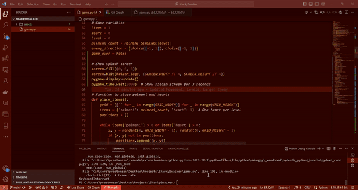

# Sharky Snacker

Sharky Snacker is an engaging arcade-style game where players help Sharky, the friendly shark, dodge the cunning Slavic Witch and munch on delicious pelmeni. Proudly designed by the imaginative team at Kaizen Gaming, our indie studio.

## Gameplay



Navigate through the treacherous waters, outswim the Slavic Witch, and collect as many pelmeni as you can. Each level increases in difficulty, challenging your reflexes and strategy.

### Controls

- Use the arrow keys or `W`, `A`, `S`, `D` to move Sharky around.
- Dodge the Slavic Witch while collecting pelmeni and hearts.
- Press `Space` to play again upon game over.

### Features

- Responsive controls for fluid navigation.
- Progressive difficulty with each level for engaging gameplay.
- Retro-inspired graphics paired with charming sound effects.
- An energetic soundtrack that keeps you in the zone.


## Installation and Prerequisites

To play Sharky Snacker, you'll need Python and Pygame installed on your system.

```sh
pip install pygame
```

After installing the prerequisites, follow these steps:

1. Clone this repository or download the ZIP file.
2. Navigate to the game's directory.
3. Run the game with python sharky_snacker.py.

## Credits
Sharky Snacker is crafted with ❤️ by Kaizen Gaming. A huge shoutout to our dedicated team members for bringing this game to life.


### License
Sharky Snacker is shared under the DBAD (Don't Be a Dick) License. Feel free to use and share this game, but always give credit where it's due.